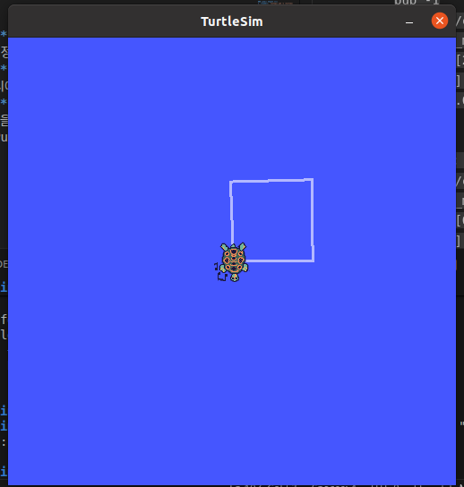
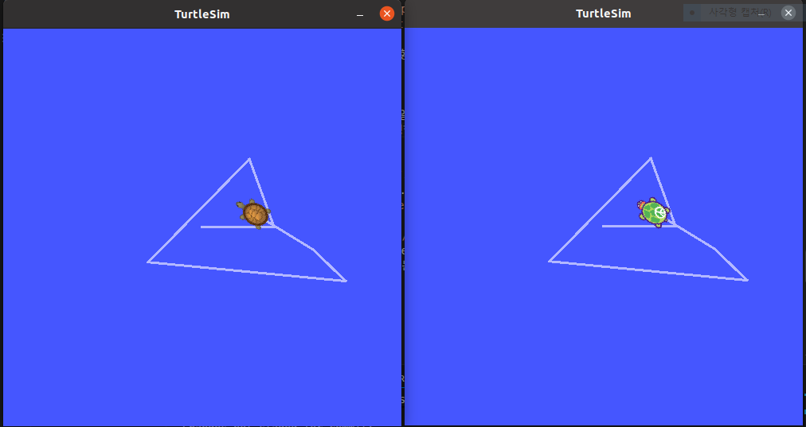

# ROS 환경 정보
- OS : Ubuntu 20.04 (VMware)
- ROS Version : ROS noetic Desktop Full
- Workspace : '~/catkin_ws'

# ROS 설치과정
1. source list
```bash
sudo sh -c 'echo "deb http://packages.ros.org/ros/ubuntu $(lsb_release -sc) main" > /etc/apt/sources.list.d/ros-latest.list'
```
2. Set up your keys
```bash
sudo apt install curl
curl -s https://raw.githubusercontent.com/ros/rosdistro/master/ros.asc | sudo apt-key add -
```
3. Installation
```bash
sudo apt update
```
```bash
sudo apt install ros-noetic-desktop-full
```
4. Environment setup
```bash
source /opt/ros/noetic/setup.bash
```
```bash
echo "source /opt/ros/noetic/setup.bash" >> ~/.bashrc
source ~/.bashrc
```
5. Create a ROS Workspace
```bash
mkdir -p ~/catkin_ws/src
cd ~/catkin_ws/
catkin_make
```
```bash
source devel/setup.bash
```
```bash
echo $ROS_PACKAGE_PATH
```

# rosdep(의존성 도구 설치)
```bash
sudo apt install python3-rosdep python3-rosinstall python3-rosinstall-generator python3-wstool build-essential
sudo rosdep init
rosdep update
```

# 설치 확인(Verification)
- ```rosversion -d``` (출력결과:```noetic```)

## 과제 2: /turtle1/pose 관찰 및 필드 분석

`rostopic echo /turtle1/pose` 명령어를 통해 거북이의 실시간 상태를 확인

- **x**: 거북이의 가로 위치. 오른쪽으로 갈수록 값이 커진다. (0 ~ 11.0 사이)
- **y**: 거북이의 세로 위치. 위쪽으로 갈수록 값이 커진다. (0 ~ 11.0 사이)
- **theta**: 거북이가 바라보는 방향 (라디안 단위). 
  - 0은 오른쪽, $\pi/2$(약 1.57)는 위쪽, $\pi$(약 3.14)는 왼쪽을 의미한다.
- **linear_velocity**: 거북이의 현재 전진/후진 속도. (방향키 위/아래 입력 시 변함)
- **angular_velocity**: 거북이의 현재 회전 속도. (방향키 좌/우 입력 시 변함)

### /turtle1/pose 데이터 특징
1. **좌표계 범위**: 원점(0,0)은 왼쪽 하단이며, 전체 맵은 약 11.0 x 11.0의 크기를 가짐을 확인.
2. **방향(theta) 데이터**: 
- 단위는 라디안(radian)을 사용함.
- 반시계 방향으로 회전 시 값이 증가함.
3. **업데이트 주기**: 거북이가 이동하지 않는 정지 상태에서도 약 60Hz(초당 60번)의 주기로 위치 데이터가 계속해서 발행(publish)됨을 확인.

## 과제 3: turtlesim 토픽 및 메시지 구조 분석

실행 중인 `turtlesim_node`에서 발행/구독되는 주요 토픽들의 구조를 분석.

### 1. /turtle1/cmd_vel
- **Type**: `geometry_msgs/Twist`
- **Description**: 거북이에게 이동 명령을 내리는 토픽 (구독자: turtlesim_node)
- **Structure**:
  - `linear` (Vector3): 직진 속도 ($x, y, z$) - 주로 $x$축 사용
  - `angular` (Vector3): 회전 속도 ($x, y, z$) - 주로 $z$축 사용

### 2. /turtle1/pose
- **Type**: `turtlesim/Pose`
- **Description**: 거북이의 현재 상태 정보를 발행하는 토픽 (발행자: turtlesim_node)
- **Structure**:
  - `x`, `y`: 위치 좌표 (`float32`)
  - `theta`: 방향 (`float32`, radian)
  - `linear_velocity`, `angular_velocity`: 현재 속도 (`float32`)

### 3. /turtle1/color_sensor
- **Type**: `turtlesim/Color`
- **Description**: 거북이 위치의 배경 색상 정보를 전달함
- **Structure**: `r`, `g`, `b` (uint8, 0~255 범위)

## 과제 4: rostopic pub으로 정사각형 그리기

명령줄 인터페이스(CLI)를 통해 거북이에게 직접 속도 명령을 전달하여 정사각형 경로를 주행함.

### 과제 4 실행 결과 화면


### 사용한 명령어 순서
1. **직진**: `rostopic pub -1 /turtle1/cmd_vel geometry_msgs/Twist -- '[2.0, 0.0, 0.0]' '[0.0, 0.0, 0.0]'`
2. **90도 회전**: `rostopic pub -1 /turtle1/cmd_vel geometry_msgs/Twist -- '[0.0, 0.0, 0.0]' '[0.0, 0.0, 1.5708]'`
3. 위 과정을 4회 반복하여 정사각형 궤적 생성 완료.

## 과제 5: turtlesim 2개 동시 실행 관찰

`__name` 파라미터를 사용하여 동일한 노드를 서로 다른 이름으로 실행하는 실습을 진행함.

### 과제 5 실행 결과 화면


### 관찰 결과
- **노드 목록**: `/turtlesim`과 `/my_turtle` 두 개의 노드가 정상 실행됨을 확인.
- **동작 원리**: `turtle_teleop_key`로 조종 시 두 거북이가 동시에 움직임.
- **원인 분석**: 두 노드 모두 `/turtle1/cmd_vel` 토픽을 구독(Subscribe)하고 있기 때문에, 하나의 발행자(Publisher)가 보내는 메시지를 동시에 수신함.

# Launch 파일을 활용한 노드 관리
### 실습 1: turtlesim 멀티 런치 파일 (`multi_turtle.launch`)
- **목표**: 한 번에 거북이 2마리를 띄우고, 통신 간섭 없이 각각 독립적으로 제어함.
- **핵심 기술**:
  - `name="turtle2"`: 노드 이름을 다르게 지정하여 중복 실행 시 발생하는 충돌을 방지함.
  - `<remap>`: 두 번째 거북이의 구독 토픽을 `/turtle1/cmd_vel`에서 `/turtle2/cmd_vel`로 변경(리맵핑)하여 통신망을 분리함.
- **결과**: 키보드 조작(`teleop`)으로는 첫 번째 거북이만 움직이고, 터미널에서 `rostopic pub`으로 `/turtle2/cmd_vel`에 명령을 보내면 두 번째 거북이만 따로 제어됨을 확인함.

### 실습 2: param을 활용한 런치 파일 (`color_turtle.launch`)
- **목표**: 런치 파일 내부에서 파라미터(Parameter)를 설정하여 turtlesim의 배경색을 변경함.
- **핵심 기술**:
  - `<param>`: 노드 실행 시 파라미터 서버에 초기 설정값(RGB)을 등록함. (실습에서는 모두 0으로 설정하여 검은 배경 생성)
  - `rosparam set`: 노드 실행 도중에 파라미터 값을 동적으로 변경함.
  - `rosservice call /clear`: 변경된 배경색을 화면에 즉시 적용(새로고침)하도록 서비스에 요청함.
- **결과**: 노드 실행 시 검은색 배경이 적용되며, 터미널 명령어를 통해 빨간색, 파란색 등으로 배경색을 실시간으로 바꾸는 데 성공함.

### 실습 3: include로 런치 파일 합치기 (`full_turtle.launch`)
- **목표**: 기존 런치 파일을 모듈처럼 재사용하고, 노드 시각화 도구를 추가로 실행함.
- **핵심 기술**:
  - `<include>`: 다른 런치 파일(`color_turtle.launch`)을 그대로 불러와 코드를 재사용함.
  - `$(find 패키지명)`: ROS 시스템에서 해당 패키지의 절대 경로를 자동으로 찾아 에러를 방지함.
- **결과**: `roslaunch` 명령어 한 번으로 거북이 화면, 조종기, 그리고 현재 통신 상태를 보여주는 `rqt_graph` 창이 동시에 실행됨을 확인함.

# ROS Pub/Sub 기초 및 응용 실습
### 1. 기본 카운터 Pub/Sub과 필터링 (실습 1~3)
* **목표**: 정수 데이터를 발행(Publish)하고 수신(Subscribe)하는 기초 통신 구조를 이해하고, 조건문을 통한 데이터 필터링을 실습함.
* **핵심 기술**:
    * **`rospy.Publisher`**: 1초마다(`Rate(1)`) 정수를 1씩 증가시키며 `/counter` 토픽으로 발행.
    * **`rospy.Subscriber`**: 발행된 데이터를 실시간으로 낚아채 화면에 출력.
    * **`if msg.data % 2 == 0`**: 수신된 데이터 중 짝수만 골라내어 출력하는 필터링 로직 구현.
* **결과**: `counter_pub`이 보내는 연속된 숫자 중 `counter_even_sub` 터미널에만 **2, 4, 6...**과 같이 짝수가 출력됨을 확인함.

---

### 2. 랜덤 온도 센서 시뮬레이터 (응용 A)
* **파일명**: `temp_pub.py`, `temp_sub.py`
* **목표**: 소수점(`Float32`) 데이터를 다루고, 특정 임계치 이상일 때 경고 시스템을 구축함.
* **핵심 기술**:
    * **`random.uniform(20.0, 40.0)`**: 실제 센서처럼 20~40도 사이의 랜덤한 소수점 온도를 생성.
    * **`rospy.logwarn`**: 온도가 35.0도 이상일 경우 터미널에 노란색 경고 문구를 출력하여 가독성을 높임.
* **결과**: 실시간으로 변하는 온도 값 중에서 **35도 이상 고온 감지 시**에만 즉각적인 경고 메시지가 정상 작동함을 확인함.

---

### 3. 거북이 자동 이동 제어 (응용 B)
* **파일명**: `turtle_circle.py`
* **목표**: 키보드 조종 없이 코드를 통해 `turtlesim` 거북이를 원형으로 자동 주행시킴.
* **핵심 기술**:
    * **`geometry_msgs/Twist`**: 로봇 제어의 표준 메시지 타입을 사용.
    * **`linear.x` & `angular.z`**: 전진 속도와 회전 속도를 동시에 부여하여 일정한 궤적(원)을 그리게 함.
* **결과**: `rosrun` 실행 즉시 거북이가 화면에서 멈추지 않고 **예쁜 원을 그리며 무한 주행**하는 것을 확인함.

---

### 4. 거북이 위치 감시 및 충돌 방지 (응용 C)
* **파일명**: `turtle_pos_sub.py`
* **목표**: 거북이의 현재 좌표를 실시간으로 모니터링하여 벽 충돌 위험을 알림.
* **핵심 기술**:
    * **`/turtle1/pose`**: 거북이의 x, y 좌표 정보를 담은 토픽을 구독.
    * **`rospy.logerr`**: 거북이 좌표가 화면 끝(1.0 이하 또는 10.0 이상)에 도달하면 빨간색 에러 로그로 위험 상황을 알림.
* **결과**: 키보드로 거북이를 벽 쪽으로 몰았을 때, **충돌 직전 터미널에 실시간 빨간색 경고**가 뜨는 시스템을 구축함.
